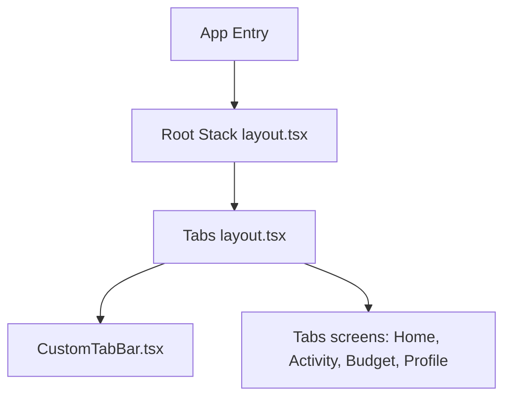

# Architecture Documentation

This document describes the high-level architecture of `WhereCash`, a modern, polished personal finance application built using Expo, React Native, and TypeScript.

---

## 1. Directory Structure

The project follows a standard modular organization:

- **`src/app/`**: Routing tree managed by Expo Router.
  - `_layout.tsx`: Root application container configuring global providers (`GestureHandlerRootView`, font preloading, status bar styling).
  - `(tabs)/_layout.tsx`: Tabs layout using Expo Router `<Tabs>` and mapping routes to screens using our animated floating custom tab bar.
  - `(tabs)/index.tsx`, `budget.tsx`, `profile.tsx`, `transactions.tsx`: Screen components.
- **`src/features/`**: Feature-specific logical layers.
  - `[feature_name]/hooks/`: Feature-specific custom hooks (e.g. `useProfileScreen.ts`, `useAnalyticsScreen.ts`) containing headless logic, state orchestrators, and side-effects.
- **`src/components/`**: Reusable UI components.
  - `profile/`: Screen-specific components like `ImportSheet.tsx`, `BackupSyncSheet.tsx`.
  - `CustomTabBar.tsx`: Custom bottom navigation bar incorporating sliding spring indicators, micro-interactions, haptic feedback, and platform safe-area contexts.
  - `GlassCard.tsx`, `CustomButton.tsx`, `AppText.tsx`: Core UI elements styled to match the theme.
- **`src/store/`**: Global state management powered by Zustand.
  - `themeStore.ts`: Tracks active theme mode (`light` or `dark`).
  - `authStore.ts`: Simple user authentication and initialization mock.
  - `transactionStore.ts`: Local transaction records and transaction persistence.
- **`src/hooks/`**: Custom React hooks.
  - `useTheme.ts`: Helper interface resolving colors and toggle methods.
  - `useCachedFonts.ts`: Asynchronously preloads Google Fonts (`Poppins`, `Inter`).
- **`src/constants/`**: Colors, dimensions, typography scale configurations.

---

## 2. Navigation Architecture

`WhereCash` employs file-based routing:
1. **Root Stack**: Standard stack navigator transitioning between screens (header hidden). The first route is `(tabs)`.
2. **Bottom Tabs**: Replaces standard bottom tab bar with an animated custom component (`CustomTabBar`).

### Custom CustomTabBar Integration
Instead of rendering static tabs, the layout renders `CustomTabBar` which fetches safe area insets via `react-native-safe-area-context` to dynamically position itself at the bottom of the screen.

---

## 3. Component Details & Interactions

### CustomTabBar (`src/components/CustomTabBar.tsx`)
- **Glassmorphic Layout**: Blurs screen content on iOS using `expo-blur`. Fallback semi-transparent backgrounds are applied on Android.
- **Micro-Interactions**:
  - Unfocused tabs show only their respective icons.
  - Selecting a tab triggers a scale increase on the icon (`1.12x`), shifts it upward (`translateY: -8px`), and spring-fades its text label (`opacity: 1`, `translateY: 0`) from below.
- **High-Performance Animations**: Powered by `react-native-reanimated` running transitions directly on the native thread.
  - Horizontal translation of the active indicator uses `withSpring`.
- **Haptics**: Triggers selection feedback via `expo-haptics` to reassure user interactions.

### GlassCard (`src/components/GlassCard.tsx`)
- **Liquid Glassmorphic System**: Employs frosted glassmorphism across both themes (frosted white `tint="light"` in light mode, frosted black `tint="dark"` in dark mode).
- **Refraction Gradients**: Combines `BlurView` with dynamic, subtle linear gradients overlaid underneath to simulate natural glass refraction.
- **Top Shine Line**: Adds a 1px solid white reflection highlight bar with high opacity at the upper edge to resemble thick, polished sheet glass.
- **Deep Shadows**: Implements multi-level, low-opacity drop shadows (`shadowRadius` up to 16) to give the illusion of elevation and tangible physical depth.

### CategoryIcon (`src/components/CategoryIcon.tsx`)
- **Professional Iconography**: Standardized on high-quality vector outline icons from `@expo/vector-icons/Ionicons` instead of generic platform emojis.
- **Frosted Badges**: Each icon is centered inside a micro-bordered glassmorphic square container styled with a matching low-opacity background (18% opacity) and a thin translucent border matching the category's theme color.

### ProgressRing (`src/components/ProgressRing.tsx`)
- **Center Vector Badge**: Renders category-specific vector icons centered within the SVG circle, styled inside a micro circular liquid-glassmorphic badge (translucent backdrop, border, and custom-colored drop shadow glow).
- **Utilization Colors**: Dynamically adapts the stroke color based on utilization percentages or custom theme overrides.

### Budget Monthly Overview Card (`src/app/(tabs)/budget.tsx`)
- **Interactive State-Based Iconography**: Integrates an `AnimatedIcon` that changes based on budget utilization (normal `wallet`, warning `trending-up` at 85%, and red `alert-circle` over-budget). The alert icon loops a scale pulse animation to draw attention.
- **Worklet-Driven Spring Animations**: Offloads animations (progress bar filling and entrance layout transitions) to Reanimated worklets on the native UI thread, achieving smooth 60 FPS performance.
- **Staggered Entrances**: Staggers entrance animations for the Overview card, Progress Rings, and Planned Payments timeline to create a premium, polished dashboard transition.

---

## 4. Global State & Theme Integration

- Theme values (`LightTheme` and `DarkTheme` from `src/constants/themes.ts`) are hooked dynamically in UI components using the `useTheme` interface.
- Changing theme mode automatically triggers color updates within the custom tab bar (dynamic transition from lime neon indicators on light theme to soft glassmorphic indigo indicators on dark theme).

## 5. Multi-Layer Refactoring & Headless Logic Standards

To ensure clean architecture, high developer velocity, and robust maintenance, the codebase enforces a strict separation of concerns between visual presentation layers and business logic layers:

### 1. Directory Structure (`src/features/`)
Feature-specific logical units are isolated under the `src/features/` directory:
- **`src/features/[feature_name]/hooks/`**: Exposes Custom Hooks encapsulating all headless logic (e.g., local screen state, form validation, device haptics, store triggers, network requests, and query parameters).
- **`src/features/[feature_name]/components/`**: Exposes atomic sub-components specific to the feature.
- **`src/app/`**: Serves as the routing tree. Screens here act as lean declarative "View Shells" (typically < 150 lines) that bind hooks directly to presentation components.

### 2. Strict Headless UI Contract Guidelines
- **Zero Raw State/Haptics in View Shell**: Screens under `src/app/` must not import raw Zustand stores directly, trigger device haptics, or manage local form input validation states.
- **Hook Ownership**: Feature hooks are the sole owners of user interaction handling, form state management, query parameters (e.g., `useLocalSearchParams`), and toast notifications.
- **Visual Uniformity**: Visual output, layout styles, and animations (e.g., `react-native-reanimated`) must remain structurally clean and draw exclusively from global theme tokens (`colors.brand`, `colors.background`, `colors.text`) without inline hardcoding.

### 3. Chronological Running Balance Calculation
To support displaying chronological running balances in both Dashboard and Activity features without overloading layout components or introducing state synchronization bugs:
- **Headless Utility Layer**: The business logic is isolated in a standalone utility function `calculateRunningBalances` inside [balanceCalculator.ts](file:///c:/Users/sowbh/Desktop/MoneyApp/src/features/transactions/utils/balanceCalculator.ts). This tracks transactions chronologically (ascending date) per account, performs mock balances passes starting from zero, offsets the result to match the current balance, and returns a Map of transaction ID to post-transaction running balance.
- **State Flow**: Calculations are memoized at the hook level (`useTransactions` and `useDashboardData`) and exposed directly via screen view models, maintaining lean UI components that consume `balanceAfter` as a standard React prop.

### 4. Loan Repayment Flow, Reminders, and Multi-Store Coordination
To support advanced full-featured loan tracking, EMI installments, and local notification reminders:
- **Unified Action Wrapper**: The custom hook `useLoans` under `src/features/ledger/hooks/useLoans.ts` orchestrates interactions across three domains:
  1. **Loans Store (`loansStore.ts`)**: Updates amortization details, increments installment counts, and computes `nextPaymentDate`.
  2. **Transaction Ledger (`transactionStore.ts` & `accountStore.ts`)**: Automatically builds and posts standard ledger transactions (Category: `"Loan Payment"` or `"Loan Principal"`, Source: `'loan'`) and updates corresponding account balances dynamically.
  3. **Notification Service (`notificationService.ts` via Expo Notifications)**: Dynamically requests user permissions, schedules high-priority local reminder alerts on the due dates, and dynamically reschedules/invalidates alerts when installments are checked off or loans are deleted.
  4. **Loan Details Modal (`LoanInfoSheet.tsx`)**: Exposes full CRUD settings, visual progress bars, linked account identifiers, and interactive toggles for notification alarms.
  5. **Smart Fast Feedback**: The `Record EMI Installment` action features a mock network delay (~600ms) with a loading spinner (`ActivityIndicator`) and interactive block to avoid double-taps and provide a smart feeling of transaction finalization.
  6. **Custom Time Selection UI**: Instead of simple boolean toggles, the system renders a modern, glassmorphic horizontal time preset selector (Morning/9:00 AM, Midday/1:00 PM, Evening/6:00 PM) for granular repayment alarms.
  7. **Vertical Installments Overview**: A secondary vertical feed of installment details is rendered in `ledger.tsx` when `activeTab === 'loans'`, featuring inline interest metrics, progress trackers, and relative payment urgency dates (e.g., due date days remaining status badges).
  8. **Undo Repayment Action**: An "Undo Last" button is exposed when `completedPayments > 0`. This reverses the last installment increment, subtracts the EMI amount from the paid balance, rolls back the payment date by one month, and deletes the corresponding ledger transaction while updating the source account balance accordingly.
  9. **Full-Fledged Activity Screen Integration**: Repayment transactions display a custom "Loan" source badge (styled in `#3B82F6` blue) in the Activity list. Swipe-deleting a loan transaction from the Activity list automatically rollbacks the linked loan parameters (decrementing payment counts, reverting due dates, and rescheduling notifications) in addition to updating account balances. Direct editing of loan transactions is disabled inside the edit details sheet; a warning banner is shown, and the user is provided a shortcut link to jump to the Loans ledger to manage it safely.
  10. **Spacious Scrollable Activity Headers**: The Activity/Transactions screen header incorporates three horizontal scrollable filtering rows: a scrolling list of Accounts, a scrolling type selector bar (offering All, Income, Expense, Transfer, and **Loans** filters), and a horizontal scrolling list of Categories. Filtering by "Loans" dynamically retrieves all transactions with `source === 'loan'`. To prevent clutter and ensure readability, the headers use horizontal `ScrollView` elements and a spacious padding/gap system (`gap: Spacing['3']`, `paddingTop: Spacing['2']`, `paddingBottom: Spacing['4']`).

### 5. Multi-Source Financial Import Engine
To support loading large transactional datasets from spreadsheets and format configurations:
- **Presentation Layer**: The component `ImportSheet.tsx` exposes a beautiful, animated multi-step configuration:
  1. **Source Selection**: High-end linear gradient cards for CSV, JSON backup, bank statement mapping, or text pasting. Includes an inline interactive CSV schema quick reference grid.
  2. **Storage Permission Shield**: A secure glassmorphic illustration page explaining why local file access is needed, providing an interactive toggle button with tactile feedback before initializing the device document picker.
  3. **Local File Ingestion**: Seamless integration of `expo-document-picker` and `expo-file-system` to pick files from device storage, enforce extensions (`.csv`, `.json`), read files into memory, and calculate file statistics.
  4. **Data Preview & Verification**: Performs a dry-run parsing phase before committing data, displaying an interactive dashboard card of the import payload (Total count, Incomes, Expenses) and rendering a preview list of the first three transactions with status badges. Automatically normalizes varying date formats (e.g., MM/DD/YYYY, MM-DD-YYYY, YY-MM-DD) to standard ISO YYYY-MM-DD strings to prevent Hermes JavaScript engine parser crashes.
  5. **Immersive Loading Screen**: Covers the import process with a glowing overlay featuring dual-ring rotating spinners, a liquid progress bar, and dynamic status updates ("Reading bytes...", "Mapping columns...", "Saving to database...") transitioning on timers alongside soft haptic vibrations.
  6. **Import Done Feed**: Renders a success spring animation alongside stats and a scrollable confirmation list of the successfully written transactions.
- **Headless Wiring**: Mounted directly under `profile.tsx` settings card, state-controlled via `useProfileScreen` hooks.

### 6. High-Performance Alignment-Correct Chart System
To resolve rendering bugs under high transactional spikes and edge-point clipping:
- **Cash Flow Bar Chart**:
  - **Headroom Coefficient**: Raised to `1.20` to guarantee bars never clip or touch the upper container edges during major currency variance.
  - **Grid-Bar Synchronization**: Separates bar pairs and label text elements into distinct, bottom-anchored Flex column blocks of a fixed height (`CHART_H + 24`). Bars reside inside a container with `justifyContent: 'flex-end'`, perfectly aligning the bar bottom coordinates with the grid line offset heights mathematically.
- **Savings Trend Line Chart**:
  - **Edge Clipping Fix**: Introduces horizontal padding (`PADDING_H = 20`) to the canvas calculations, mapping the SVG path coordinates within `CHART_W - PADDING_H * 2` to keep boundary circles completely within bounds.
  - **Theme-Aware Halo**: Replaces mismatching white halos with an SVG stroke using `colors.background.secondary` to naturally blend dots over glass cards.
  - **Absolute Label Tracking**: Centers labels directly under each SVG point by computing `left: getX(i) - 30` relative to the parent coordinate map.

### 7. Refactored Analytics Modular Infrastructure
To improve code reusability, testability, and layout clarity for the Analytics dashboard:
- **Lean View Shell**: Reduced `src/app/analytics.tsx` to a declarative orchestrator (< 130 lines) rendering modular widgets and utilizing data hooks.
- **Headless Hook Expansion**: Shifted modal display states (`fullscreenChart`) and custom currency abbreviation text formatting functions (`formatAmount`, `formatFull` linked to `useFormatCurrency`) directly into the custom hook `useAnalyticsScreen.ts`.
- **Atomic Component Extraction**: Split the massive layout into six typed, self-contained components in `src/components/analytics/`:
  1. `SectionTitle.tsx`: Unified section header fonts and paddings.
  2. `GrowthCard.tsx`: Metric presentation and positive/negative trend chevron badges.
  3. `CashFlowChart.tsx`: Flex column bar pairs, background grid dividers, and tap overlay tooltip triggers.
  4. `TrendLineChart.tsx`: SVG rendering path calculations, custom definitions, selection anchors, and relative labels.
  5. `MiniDonut.tsx`: Border-radius based categorization circle rings.
  6. `FullscreenChart.tsx`: Flexible slide-up modals that accept child charts for widescreen overlays.

### 8. High-Performance Financial Ledger & Optimization Layer
To support high-performance infinite scrolling with 10,000+ entries and zero floating-point accumulation errors:
- **Cents-Based Fixed-Point Math**: All ledger transactions, running balances, daily totals, and growth rate computations utilize integer-cents operations via [moneyMath.ts](file:///c:/Users/sowbh/Desktop/MoneyApp/src/utils/moneyMath.ts) to eliminate IEEE 754 precision issues.
- **FlatList Virtualization**: Refactored the transactions screen feed in [transactions.tsx](file:///c:/Users/sowbh/Desktop/MoneyApp/src/app/(tabs)/transactions.tsx) from ScrollView to an optimized `FlatList` with restricted render boundaries (`windowSize={5}`, `initialNumToRender={5}`, `removeClippedSubviews={true}`) to maintain a constant low memory footprint.
- **Synchronous Fast Caching**: Employs query caches and pre-hydrated account balances to ensure instant 0ms app start times, avoiding parsing massive historical datasets on initialization.

### 9. Interactive Walkthrough & Spotlight Engine
To decouple layout calculations, animation state, and visual presentation within the interactive tutorial system:
- **Layout Logic Extraction**: Absolute coordinate configurations for each screen tour step are isolated as a pure layout config calculator in [layout.ts](file:///c:/Users/sowbh/Desktop/MoneyApp/src/features/tutorial/utils/layout.ts).
- **Headless Feature Hooks**:
  - `useTutorialSpotlight`: In [useTutorialSpotlight.ts](file:///c:/Users/sowbh/Desktop/MoneyApp/src/features/tutorial/hooks/useTutorialSpotlight.ts), manages the spotlight Reanimated shared value drivers (`pulseScale`, `scale`, `opacity`), tracks active store steps, handles device haptic impulses, and maps coordinates.
  - `useInteractiveGuides`: In [useInteractiveGuides.ts](file:///c:/Users/sowbh/Desktop/MoneyApp/src/features/tutorial/hooks/useInteractiveGuides.ts), coordinates tour launch triggers, reset states, and delayed screen transitions for sheets.
- **Atomic Presentation Components**: 
  - [SpotlightFrame.tsx](file:///c:/Users/sowbh/Desktop/MoneyApp/src/components/tutorial/SpotlightFrame.tsx): Renders the pulsing SVG-like glowing spotlight ring and target text label badge.
  - [TutorialStepCard.tsx](file:///c:/Users/sowbh/Desktop/MoneyApp/src/components/tutorial/TutorialStepCard.tsx): Houses step details, progress indicator dots, back/next/skip control buttons, and gesture swipe hands.
- **Lean Component Shells**:
  - [TutorialSpotlightModal.tsx](file:///c:/Users/sowbh/Desktop/MoneyApp/src/components/tutorial/TutorialSpotlightModal.tsx): Reduced to a declarative modal shell (< 80 lines) delegating state and sub-components.
  - [InteractiveGuidesSheet.tsx](file:///c:/Users/sowbh/Desktop/MoneyApp/src/components/profile/InteractiveGuidesSheet.tsx): Simplified component rendering mapped tour listings and start/reset triggers.

### 10. Modernized Dashboard Architecture & High-Affordance Redesign
To resolve cognitive overload, eliminate duplicated navigation routes, prevent Android font clipping, and increase action affordance:
- **Lean View Shell**: Reduced [index.tsx](file:///c:/Users/sowbh/Desktop/MoneyApp/src/app/(tabs)/index.tsx) to an ultra-lean declarative shell (< 140 lines) delegating state to `useHomeScreen` and rendering atomic widgets.
- **Android Font Clipping Cure**: In [Typography.ts](file:///c:/Users/sowbh/Desktop/MoneyApp/src/constants/Typography.ts) and [AppText.tsx](file:///c:/Users/sowbh/Desktop/MoneyApp/src/components/AppText.tsx), neutralized positive letter-spacing on Android and added `includeFontPadding: false` to eliminate trailing glyph truncation on custom fonts (e.g. "Expens" -> "Expense").
- **High-Affordance Tactile Quick Actions**: Extracted [HomeQuickActions.tsx](file:///c:/Users/sowbh/Desktop/MoneyApp/src/features/dashboard/components/HomeQuickActions.tsx) featuring elevated 60x60px squircle buttons with vibrant borders, colored drop shadows, and anti-clipping typography. Replaced duplicate "Activity" action with "Split / Due" routing to the Ledger tab.
- **Interactive Luxury Balance Card**: Extracted [HomeBalanceCard.tsx](file:///c:/Users/sowbh/Desktop/MoneyApp/src/features/dashboard/components/HomeBalanceCard.tsx) with lush emerald gradient, privacy toggle (`hideBalance`), and net savings pulse.
- **Progressive Disclosure Sections**:
  - [ThisMonthOverview.tsx](file:///c:/Users/sowbh/Desktop/MoneyApp/src/features/dashboard/components/ThisMonthOverview.tsx): 3-card grid (Income, Expenses, Net Saved) with Financial Insights analytics banner.
  - [HomeSpendingSection.tsx](file:///c:/Users/sowbh/Desktop/MoneyApp/src/features/dashboard/components/HomeSpendingSection.tsx): Top 3 spending categories with linear progress bars.
  - [HomeRecentActivitySection.tsx](file:///c:/Users/sowbh/Desktop/MoneyApp/src/features/dashboard/components/HomeRecentActivitySection.tsx): Top 3 recent transactions with account pill badges (`Cash Wallet`, `Prime Visa`).
  - [HomeUpcomingPaymentsSection.tsx](file:///c:/Users/sowbh/Desktop/MoneyApp/src/features/dashboard/components/HomeUpcomingPaymentsSection.tsx): Top 2 urgent upcoming or overdue bills with status indicators.

### 11. Multi-Layer Refactoring & Headless Logic Standards (My Accounts)
To elevate account management ergonomics, resolve zero-account spacing issues, and clarify account use cases:
- **Lean View Shell**: Refactored [accounts.tsx](file:///c:/Users/sowbh/Desktop/MoneyApp/src/app/accounts.tsx) into a declarative view shell (< 150 lines) delegating all carousel scrolling, action handling, and modal triggers to the headless hook.
- **Dynamic Net Worth Hero Spacing**: Implemented responsive top and bottom padding on the `TOTAL NET WORTH` hero (`paddingTop: 26, paddingBottom: 26` when empty vs `paddingTop: 6, paddingBottom: 16` with accounts) to prevent visual crowding against the header and cards.
- **Headless Feature Hook**: [useAccountsScreen.ts](file:///c:/Users/sowbh/Desktop/MoneyApp/src/features/accounts/hooks/useAccountsScreen.ts) computes real-time monthly cash flow (`accountInflow`, `accountOutflow`), extracts the latest transactions per account, controls modal states (`transferSheet`, `formSheet`, `deleteConfirm`), and injects account presets.
- **Atomic Presentation Components**:
  - [AccountActionBar.tsx](file:///c:/Users/sowbh/Desktop/MoneyApp/src/components/accounts/AccountActionBar.tsx): Action ribbon with fixed 40px tactile buttons, single-line text constraints (`numberOfLines={1}`, `adjustsFontSizeToFit`), and quick actions (`Transfer`, `Edit`, `Primary`, `Delete`).
  - [AccountCard.tsx](file:///c:/Users/sowbh/Desktop/MoneyApp/src/components/accounts/AccountCard.tsx): 3D carousel card featuring a prominent gold ⭐ `PRIMARY` badge next to the account type pill.
  - [AccountCashFlowRow.tsx](file:///c:/Users/sowbh/Desktop/MoneyApp/src/components/accounts/AccountCashFlowRow.tsx): Real monthly inflow and outflow comparison cards for the active carousel account.
  - [AccountRecentActivity.tsx](file:///c:/Users/sowbh/Desktop/MoneyApp/src/components/accounts/AccountRecentActivity.tsx): Shows the last 3 transactions recorded under the selected account with a 1-tap shortcut to full history.
  - [AccountEmptyState.tsx](file:///c:/Users/sowbh/Desktop/MoneyApp/src/components/accounts/AccountEmptyState.tsx): Educational onboarding card explaining why accounts are needed in personal finance, with 1-tap quick start presets (`Bank Account`, `Cash Wallet`, `Credit Card`).
  - [AccountFormSheet.tsx](file:///c:/Users/sowbh/Desktop/MoneyApp/src/components/accounts/AccountFormSheet.tsx): Creation sheet featuring an educational concept banner and dynamic live use-case cards explaining each account type (Checking, Cash, Savings, Credit, Investment).

